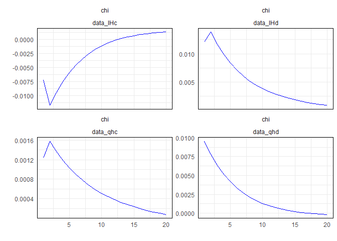

<!-- README.md is generated from README.Rmd. Please edit that file -->

# dynar

Import dynare output result file into R.

<!-- badges: start -->

[](https://cran.r-project.org/package=dynar)
[](https://www.tidyverse.org/lifecycle/#experimental)
[](https://travis-ci.org/kvasilopoulos/dynar)
[](https://ci.appveyor.com/project/kvasilopoulos/dynar)
<!-- badges: end -->

## Usage

This is a basic example which shows you how to import a
’\*\_results.mat’ file

``` r
library(dynar)


model <- mat2r("inst/main_basic_results.mat") %>% 
  clean_dynare()

str(model, 1)
#> List of 9
#>  $ M              :List of 59
#>  $ oo             :List of 14
#>  $ options        :List of 230
#>  $ estim.params   : NULL
#>  $ bayestopt      : NULL
#>  $ dataset        : NULL
#>  $ estimation.info:List of 21
#>  $ dataset.info   : NULL
#>  $ oo.recursive   : NULL
```

## Impulse Response Function

``` r
model %>% 
  irf_long() %>% 
  autoplot(filter_shock = "chi", 
           filter_var = c("data_qhc", "data_qhd", "data_IHc", "data_IHd"))
```



-----

Please note that the ‘dynar’ project is released with a [Contributor
Code of Conduct](.github/CODE_OF_CONDUCT.md). By contributing to this
project, you agree to abide by its terms.
